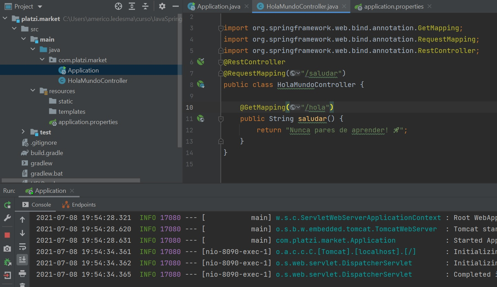
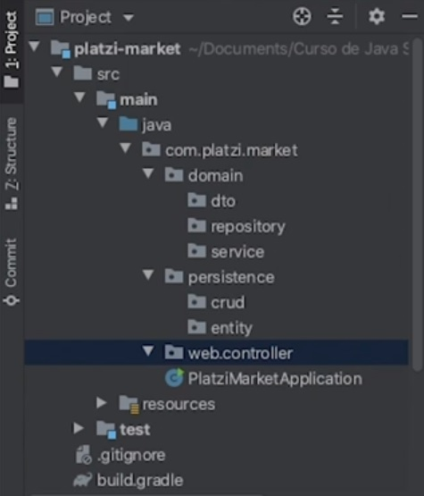
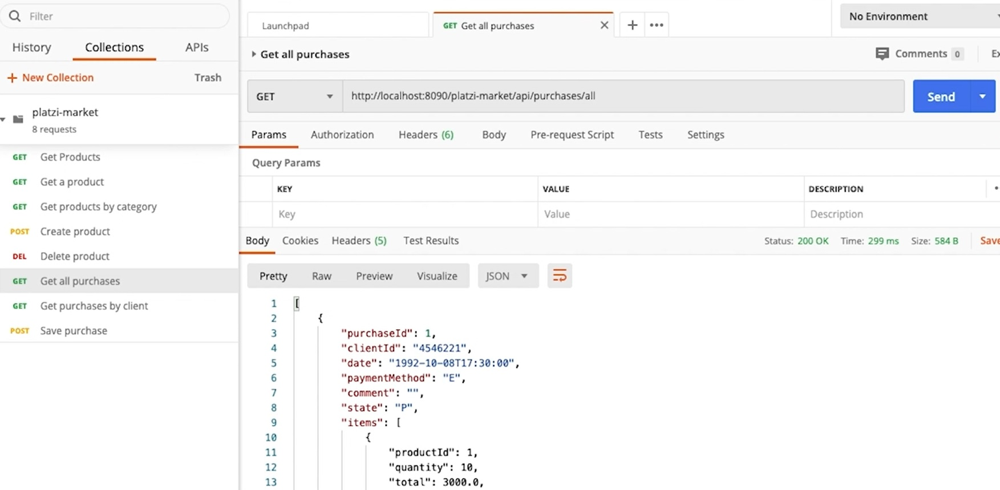
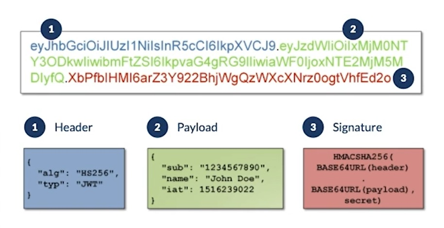

# Java Spring Course
### Table of contents
* [Introduction](#introduction) 
* [Technologies](#technologies)
* [Commands](#commands)
* [Syntax](#syntax)
* [Illustrations](#illustrations)


## Introduction
The Spring Framework is an open-source application framework that provides infrastructure support for developing Java applications. One of the most popular Java Enterprise Edition frameworks, Spring helps developers create high performing applications using plain old Java objects (POJOs).

## Technologies
* Java 11
* IntelliJ IDEA 2021
* Spring
* MySQL 
* Postman

## Commands
##### JPA
| Annotation | Description                    |
| ------------- | ------------------------------ |
| `@Entity`      | Declares the class as an entity or a table.       |
| `@Table`   | Declares table name.    | 
| `@Basic`   | Specifies non-constraint fields explicitly.     | 
| `@Embedded`   | Specifies the properties of class or an entity whose value is an instance of an embeddable class.     | 
| `@Id`   | Specifies the property, use for identity (primary key of a table) of the class.     | 
| `@Column`   | Specifies the column attribute for the persistence property.     | 
| `@ManyToMany`   | Defines a many-to-many relationship between the join Tables.     | 
| `@ManyToOne`   | Defines a many-to-one relationship between the join Tables.     | 
| `@OneToMany `   | Defines a one-to-many relationship between the join Tables.     | 

## Syntax

##### Starting with Spring Initializr
###### pom.xml file that is created when you choose Maven:
```
<?xml version="1.0" encoding="UTF-8"?>
<project xmlns="http://maven.apache.org/POM/4.0.0" xmlns:xsi="http://www.w3.org/2001/XMLSchema-instance"
	xsi:schemaLocation="http://maven.apache.org/POM/4.0.0 https://maven.apache.org/xsd/maven-4.0.0.xsd">
	<modelVersion>4.0.0</modelVersion>
	<parent>
		<groupId>org.springframework.boot</groupId>
		<artifactId>spring-boot-starter-parent</artifactId>
		<version>2.4.3</version>
		<relativePath/> <!-- lookup parent from repository -->
	</parent>
	<groupId>com.example</groupId>
	<artifactId>integration</artifactId>
	<version>0.0.1-SNAPSHOT</version>
	<name>integration</name>
	<description>Demo project for Spring Boot</description>

	<properties>
		<java.version>1.8</java.version>
	</properties>

	<dependencies>
		<dependency>
			<groupId>org.springframework.boot</groupId>
			<artifactId>spring-boot-starter-integration</artifactId>
		</dependency>
		<dependency>
			<groupId>org.springframework.boot</groupId>
			<artifactId>spring-boot-starter-test</artifactId>
			<scope>test</scope>
		</dependency>
		<dependency>
			<groupId>org.springframework.integration</groupId>
			<artifactId>spring-integration-test</artifactId>
			<scope>test</scope>
		</dependency>
	</dependencies>

	<build>
		<plugins>
			<plugin>
				<groupId>org.springframework.boot</groupId>
				<artifactId>spring-boot-maven-plugin</artifactId>
			</plugin>
		</plugins>
	</build>

</project>
```


## Illustrations

###### Creating app with Spring Initializr

**************************************
###### Project structure

**************************************
###### Postman practice

**************************************
###### How JWT(JSON Web Tokens) works


